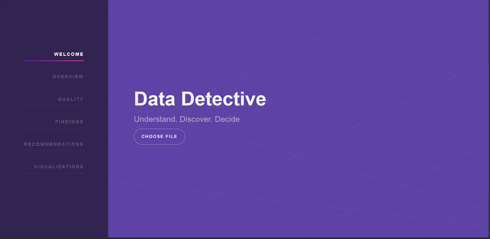
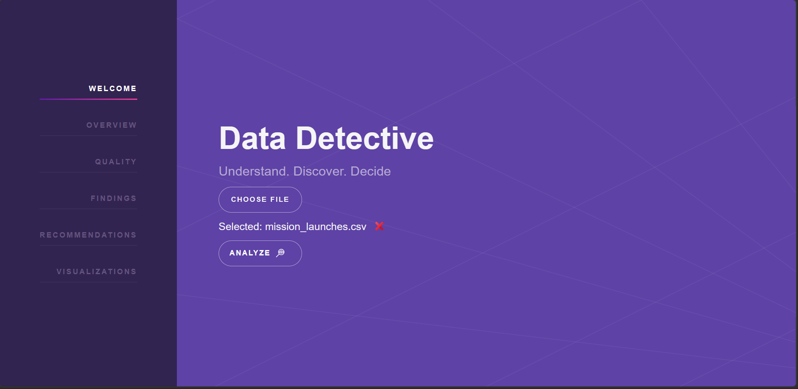
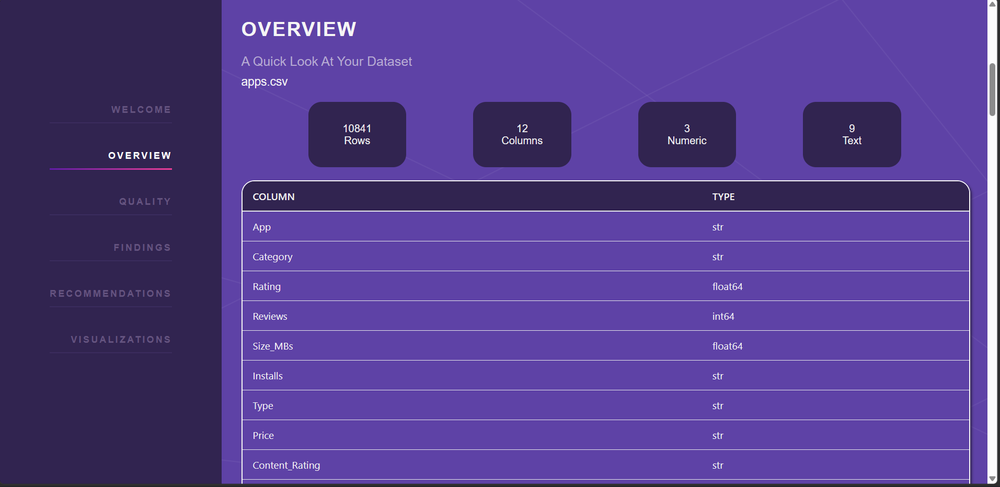
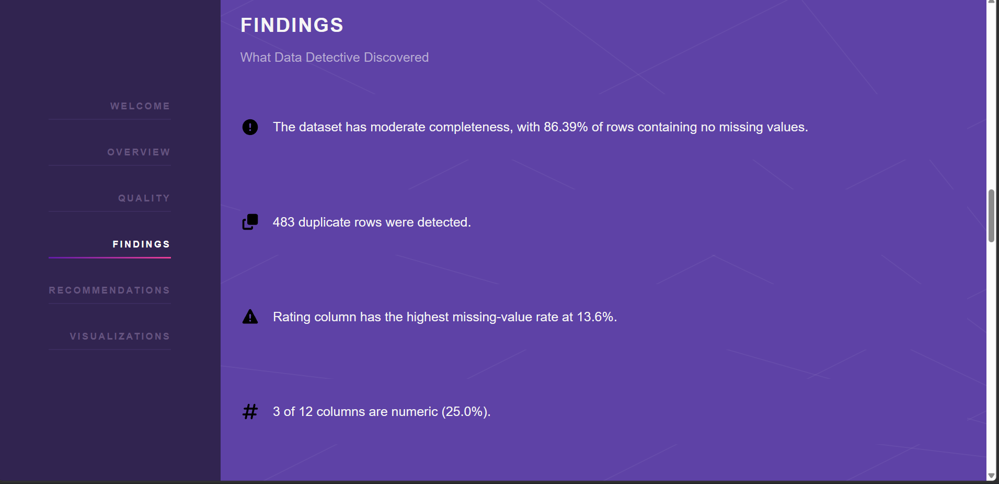
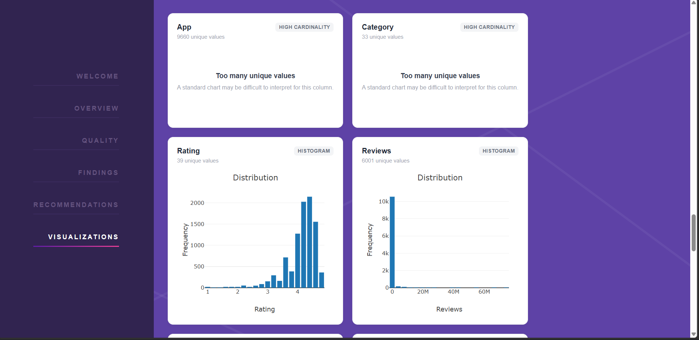

# 🕵️ Data Detective

> **Understand and Discover your data**

Data Detective is a full-stack data understanding application that helps users quickly explore unfamiliar datasets through automated analysis, meaningful findings, recommendations, and visualization suggestions.

Instead of manually inspecting rows and columns, users can upload a CSV dataset and receive a structured analysis that highlights its structure, data quality, potential issues, and useful directions for further exploration.

The goal is not to replace a data analyst, but to reduce the time and effort required to understand a new dataset.

---

## 📸 Screenshots

### Dashboard

### Dataset Upload & Analysis

### Overview Results

### Findings & Recommendations

### Visualizations

---

## ✨ Features

### Dataset Analysis

- ✅ CSV dataset upload
- ✅ Dataset overview
- ✅ Row and column information
- ✅ Column names and data types
- ✅ Missing-value analysis
- ✅ Duplicate-row detection
- ✅ Dataset completeness calculation
- ✅ Memory usage analysis
- ✅ Automated findings
- ✅ Data-driven recommendations
- ✅ Visualization suggestions

### Frontend

- ✅ Dataset upload interface
- ✅ Frontend/backend API integration
- ✅ Analysis dashboard
- ✅ Structured result presentation
- ✅ Findings display
- ✅ Recommendations display
- ✅ Visualization rendering
- ✅ Error handling
- ✅ Responsive interface

### Backend

- ✅ FastAPI REST API
- ✅ Modular analysis engine
- ✅ Separate analyzers
- ✅ Structured JSON response
- ✅ Swagger API documentation
- ✅ ReDoc API documentation
- ✅ Health-check endpoint

### Deployment

- ✅ Docker containerization
- ✅ Local Docker testing
- ✅ Amazon ECR image repository
- ✅ Amazon ECS cluster
- ✅ AWS Fargate deployment
- ✅ Live AWS deployment verification
- ✅ Render deployment
- ✅ Render deployment verification

---

## 🧠 How It Works

A dataset is processed through a modular analysis pipeline:

    CSV Dataset
         │
         ▼
    Pandas DataFrame
         │
         ▼
    Analysis Engine
         │
         ├── Overview Analyzer
         ├── Quality Analyzer
         ├── Findings Analyzer
         ├── Recommendation Analyzer
         └── Visualization Analyzer
         │
         ▼
    Structured JSON
         │
         ▼
    Frontend Dashboard

Each analyzer focuses on a specific aspect of understanding the dataset.

The modular design allows new analysis capabilities to be added without redesigning the entire system.

---

## 🔎 Current Analysis

### Overview

Provides basic information about the uploaded dataset:

- Filename
- Number of rows
- Number of columns
- Column names
- Basic data types

### Data Quality

Evaluates fundamental dataset quality characteristics:

- Missing values
- Missing-value percentages
- Duplicate rows
- Dataset memory usage
- Dataset completeness

### Findings

Converts analysis results into human-readable observations.

Examples include:

- Dataset completeness
- Duplicate-row detection
- Highest missing-value rate
- Numeric-column distribution

Findings also expose structured information that can be reused by other parts of the analysis pipeline.

### Recommendations

Generates actionable suggestions based on detected dataset issues.

For example:

    Review the 1477 missing values across the dataset,
    particularly in the Rating column.

    Review the 483 duplicated rows and remove them
    if they represent repeated records.

The recommendation system currently informs the user rather than automatically modifying the dataset.

### Visualizations

The Visualization Analyzer determines suitable visualization types based on column characteristics.

Current classifications include:

- Histograms for numeric columns
- Bar charts for low-cardinality non-numeric columns
- High-cardinality columns
- Identifier columns

The frontend uses the visualization metadata generated by the backend to render appropriate charts.

---

## 🏗️ Architecture

Data Detective follows an API-first architecture with a clear separation between the frontend, API layer, analysis engine, and individual analyzers.

    ┌──────────────────────┐
    │       Browser        │
    │                      │
    │ HTML / CSS / JS      │
    └──────────┬───────────┘
               │
               │ HTTP
               ▼
    ┌──────────────────────┐
    │    FastAPI Backend    │
    │                      │
    │ API Routes           │
    └──────────┬───────────┘
               │
               ▼
    ┌──────────────────────┐
    │    Analysis Engine   │
    └──────────┬───────────┘
               │
       ┌───────┼────────┐
       │       │        │
       ▼       ▼        ▼
    Overview Quality Findings
                        │
                   ┌────┴────┐
                   ▼         ▼
            Recommendations Visualizations
                   │         │
                   └────┬────┘
                        ▼
                 Structured JSON
                        │
                        ▼
                 Frontend Dashboard

The frontend communicates with the backend through REST API endpoints.

The analysis engine orchestrates the individual analyzers and combines their results into a single structured response.

For a detailed architecture explanation, see [`docs/architecture.md`](docs/architecture.md).

---

## 🛠️ Tech Stack

### Backend

- Python
- FastAPI
- Uvicorn
- Pandas
- Pydantic

### Frontend

- HTML5
- CSS3
- Vanilla JavaScript

### Containerization & Deployment

- Docker
- Amazon ECR
- Amazon ECS
- AWS Fargate
- Render

### Development

- Git
- GitHub
- Swagger UI
- ReDoc

---

## 📂 Project Structure

    data-detective/
    │
    ├── backend/
    │   ├── app/
    │   │   ├── api/
    │   │   ├── analyzers/
    │   │   ├── config/
    │   │   ├── engine/
    │   │   ├── schemas/
    │   │   └── utils/
    │   │
    │   └── requirements.txt
    │
    ├── frontend/
    │   ├── assets/
    │   ├── css/
    │   ├── js/
    │   ├── components/
    │   └── index.html
    │
    ├── datasets/
    │   └── sample/
    │
    ├── docs/
    │   ├── api.md
    │   ├── architecture.md
    │   ├── decisions.md
    │   ├── roadmap.md
    │   └── images/
    │
    ├── tests/
    │   ├── backend/
    │   └── frontend/
    │
    ├── .dockerignore
    ├── .gitignore
    ├── Dockerfile
    └── README.md

### Folder Responsibilities

| Folder | Responsibility |
| --- | --- |
| `backend/` | FastAPI application and analysis pipeline |
| `backend/app/api/` | API routes and endpoints |
| `backend/app/analyzers/` | Individual dataset analyzers |
| `backend/app/engine/` | Analysis orchestration |
| `backend/app/config/` | Application configuration |
| `backend/app/schemas/` | API schemas |
| `backend/app/utils/` | Reusable utility functions |
| `frontend/` | User interface and client-side logic |
| `datasets/` | Sample datasets used for development and testing |
| `docs/` | Architecture, API, roadmap, and design documentation |
| `tests/` | Backend and frontend tests |

---

## 🚀 Getting Started

### Clone the Repository

    git clone git@github.com:TheRookiexe/Data-Detective.git
    cd Data-Detective

### Create a Virtual Environment

    python3 -m venv .venv

### Activate the Virtual Environment

#### Linux / macOS

    source .venv/bin/activate

#### Windows

    .venv\Scripts\activate

### Install Dependencies

    pip install -r backend/requirements.txt

### Start the Development Server

    uvicorn backend.app.main:app --reload

The application will be available at:

    http://127.0.0.1:8000

---

## 🐳 Running with Docker

Data Detective can also be run as a Docker container.

### Build the Image

    docker build -t data-detective .

### Run the Container

    docker run --name data-detective -p 8000:8000 data-detective

The application will then be available at:

    http://localhost:8000

The Docker image is configured to use the runtime `PORT` environment variable when provided, while defaulting to port `8000` for local development.

Docker provides a consistent deployment environment across local development and cloud infrastructure.

---

## 📡 API

### Health Check

    GET /api/health

Returns the current health status of the application.

### Analyze Dataset

    POST /api/analyze

Accepts a CSV file and runs the complete Data Detective analysis pipeline.

The endpoint returns structured JSON containing:

- Overview
- Data quality
- Findings
- Recommendations
- Visualization metadata

### Swagger UI

    http://127.0.0.1:8000/docs

### ReDoc

    http://127.0.0.1:8000/redoc

For detailed API documentation, see [`docs/api.md`](docs/api.md).

---

## 📊 Example Analysis Response

A successful analysis produces a structured response containing the results of all analyzers:

    {
        "overview": {},
        "quality": {},
        "findings": {
            "insights": [],
            "data": {}
        },
        "recommendations": {
            "suggestions": []
        },
        "visualizations": {
            "numeric_columns": [],
            "non_numeric_columns": [],
            "vis": []
        }
    }

The exact results depend on the uploaded dataset.

---

## ☁️ Deployment

Data Detective has been containerized and deployed to AWS as part of the project's cloud deployment and verification process.

### AWS Deployment Architecture

    Docker Image
         │
         ▼
    Amazon ECR
         │
         ▼
    Amazon ECS
         │
         ▼
    AWS Fargate
         │
         ▼
    Running Data Detective Container

### AWS Components

- **Amazon ECR** — stores the Docker image
- **Amazon ECS** — manages the container workload
- **AWS Fargate** — runs the container without managing servers
- **IAM** — provides the required deployment and task permissions

The AWS deployment was successfully tested and the application was verified through its live endpoint and API documentation.

The AWS demonstration environment is kept minimal and the Fargate service is stopped when it is not being used for testing or demonstration.

> **Cost note:** AWS Fargate is usage-based. The demonstration service is therefore not intended to run continuously.

---

## 🚀 Render Deployment

Data Detective is also deployed to **Render** using the project's existing Dockerfile.

### Render Deployment Architecture

    GitHub Repository
          │
          ▼
       Render
          │
          ▼
    Docker Build
          │
          ▼
    Data Detective
          │
          ▼
    Public Web Application

### Deployment Configuration

- **Runtime:** Docker
- **Region:** Singapore
- **Compute:** Free instance
- **Health Check:** `/api/health`
- **Source:** GitHub
- **Branch:** `main`
- **Dockerfile:** Root-level `Dockerfile`

The Dockerfile uses Render's runtime `PORT` environment variable while retaining port `8000` as the local fallback.

### Live Application

**Render:** `https://data-detective-mc5y.onrender.com`

### Deployment Status

- ✅ Application containerized with Docker
- ✅ Docker image tested locally
- ✅ Amazon ECR deployment completed
- ✅ Amazon ECS/Fargate deployment completed and verified
- ✅ Render deployment completed
- ✅ Render deployment verified
- ✅ Public hosted application

> **Render Free plan note:** The application is hosted using Render's Free instance. Free services may spin down after inactivity and can take some time to wake when accessed again.

---

## 📌 Project Status

### MVP Status: Complete

The Data Detective MVP has been completed and verified across the main application stack.

### Backend

- [x] Project planning
- [x] Repository structure
- [x] FastAPI setup
- [x] API routing
- [x] Health endpoint
- [x] Analysis engine
- [x] Overview Analyzer
- [x] Quality Analyzer
- [x] Findings Analyzer
- [x] Recommendation Analyzer
- [x] Visualization Analyzer
- [x] Structured analysis response
- [x] Backend documentation

### Frontend

- [x] Frontend structure
- [x] Dataset upload interface
- [x] API integration
- [x] Dashboard
- [x] Analysis result presentation
- [x] Findings display
- [x] Recommendations display
- [x] Visualization rendering
- [x] Error handling
- [x] Responsive UI

### Integration & Deployment

- [x] Frontend/backend integration
- [x] End-to-end dataset analysis flow
- [x] Docker containerization
- [x] Local Docker testing
- [x] Amazon ECR setup
- [x] Amazon ECS setup
- [x] AWS Fargate deployment
- [x] Live AWS verification
- [x] Render deployment
- [x] Render deployment verification

---

## 🗺️ Roadmap

### Phase 1 — Foundation

**Completed**

- Project structure
- Development environment
- Initial architecture
- API foundation

### Phase 2 — Backend Analysis MVP

**Completed**

- Modular analysis engine
- Dataset overview
- Data quality analysis
- Findings
- Recommendations
- Visualization metadata
- Structured API response

### Phase 3 — Frontend MVP

**Completed**

- Dataset upload
- API integration
- Dashboard
- Analysis result presentation
- Findings
- Recommendations
- Visualization rendering
- Error handling
- Responsive UI

### Phase 4 — MVP Integration & Verification

**Completed**

- End-to-end frontend/backend integration
- Local testing
- Docker testing
- Application verification

### Phase 5 — Containerization & AWS Deployment

**Completed**

- Docker image
- Amazon ECR
- Amazon ECS
- AWS Fargate
- IAM configuration
- Live deployment verification

### Phase 6 — Additional Deployment & Hosting

**Completed**

- Render deployment
- Render deployment verification
- Public hosted application

### Phase 7 — Improvements

- Additional visualizations
- Advanced data-quality detection
- Better filtering
- Report export
- Accessibility improvements
- UI polish

### Phase 8 — Advanced Features

- AI-generated insights
- Natural-language dataset explanations
- Conversational dataset exploration
- User accounts
- Saved analyses
- Background processing
- Database support

For the detailed roadmap, see [`docs/roadmap.md`](docs/roadmap.md).

---

## 📚 Documentation

Detailed project documentation is available in the [`docs/`](docs/) directory.

| Document | Description |
| --- | --- |
| [`architecture.md`](docs/architecture.md) | System architecture and component responsibilities |
| [`decisions.md`](docs/decisions.md) | Important architectural and design decisions |
| [`roadmap.md`](docs/roadmap.md) | Project milestones and future development |
| [`api.md`](docs/api.md) | REST API documentation |

---

## 🤝 Contributing

Data Detective is currently being developed incrementally.

Suggestions, discussions, and improvements are welcome.

If you would like to contribute:

1. Fork the repository.
2. Create a feature branch.
3. Make your changes.
4. Test your changes.
5. Open a pull request.

---

## 📄 License

This project is licensed under the MIT License.

---

## 💡 Project Philosophy

Data Detective is built around one simple idea:

> **Help users understand their data before asking them to analyze it.**

Rather than overwhelming users with dozens of charts and statistics, the application focuses on presenting useful information in a clear, structured, and approachable way.

The project is intentionally built with a simple modular architecture that can grow as new requirements emerge.

The current MVP focuses on understanding datasets first, while leaving more advanced capabilities such as AI-assisted insights, conversational exploration, and persistent analysis for future iterations.